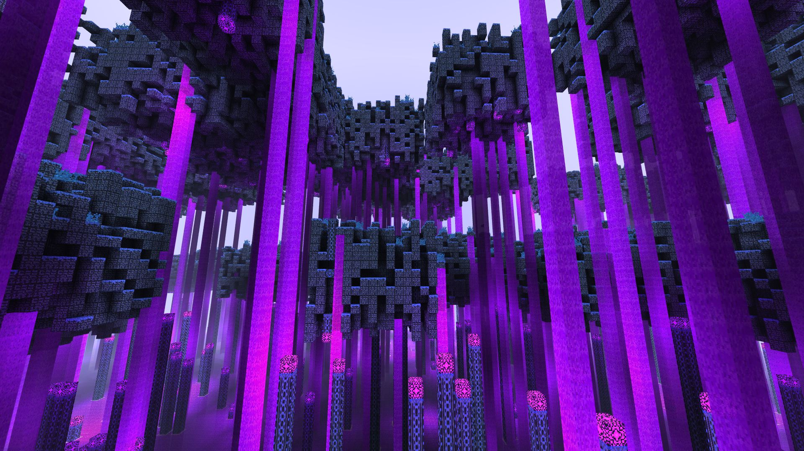

<h1 align="center">
 ⛯ Divine Voxel Engine ⛯
</h1>

<p align="center">

</p>

---

# What is this?

A multi-threaded, renderer independent, fully customizable TypeScript voxel engine. 


## To Init This Project

This project is a monorepo that holds all the Divine Voxel Engine packages and required libraries from Amodx. To initialize the project, just run the following commands:

```console
git clone https://github.com/Divine-Star-Software/DivineVoxelEngine.git
cd ./DivineVoxelEngine
git pull
git lfs pull
git submodule update --init --recursive
git submodule foreach git checkout main
git submodule foreach git pull
npm run init:all
npm install
cd ./testing/Vlox
npm run start
```


## Core Packages

- **@divinevoxel/vlox**  
  - Minecraft-like voxel data handling and meshing.  
  - Lighting, flow, power, and secondary state/voxelsystems.
  - **Vlox Model System**  
    - Similar to Blockbench models  
    - AO, lighting, and advanced texture handling  
    - Particle emitters and other custom effects  
    - Easily extensible to create custom meshed voxels  
  - World simulation engine for generation and update handling  
  - Archiving API for exporting worlds and templates as JSON  
  - **Multi-threaded**  
    - All meshing and world updates run in parallel  
    - Shared memory is optional—engine can run anywhere  

- **@divinevoxel/vlox-babylon**  
  - Renderer for DVE Vlox using Babylon.js, including Classic and PBR shaders

## Packages for Game Development

- **@dvegames/vlox**  
  - A library of components for building games with Babylon.js and `@divinevoxel/vlox`

- **@dvegames/vlox-tools**  
  - A library for creating tool panels for any `@divinevoxel/vlox` project


<details>
  <summary>In Dev Packages</summary>
These packages have not been worked on in a while and may be worked on in future if there is demand for them.

- **@divinevoxel/vlox-three**  
  - Renderer for DVE Vlox using Three.js, including Classic and PBR shaders

- **@divinevoxel/vlox-quantum**  
  - Custom renderer for DVE Vlox using WebGPU


</details>
<details>
  <summary>Getting Started</summary>

To see how to setup a simple project you check out the [VloxTest](https://github.com/Divine-Star-Software/DivineVoxelEngine/tree/main/testing/Vlox).


</details>
<details>
  <summary>Shared Memory</summary>
Originally the engine was built to use SharedArrayBuffers but that caused some issues. 
You can now turn off shared memory ussage like this:

```ts
import { StartRenderer } from "@divinevoxel/vlox/Init/StartRenderer";
//...
  const DVER = await StartRenderer({
    renderer,
    worldWorker,
    mesherWorkers,
    generatorWorkers,
    voxels: DVEVoxelData,
    memoryAndCPU: {
      useSharedMemory: false,
    },
  });

```

With `useSharedMemory` set to `false` you will only have access to world data in the World thread. 

</details>
<details>
  <summary>Voxel Model System</summary>
To see examples of how to make geometry and models for the vlox model system check out the built in models here:

[divinevoxel-vlox/tree/Voxels/Models/Defaults](https://github.com/Divine-Star-Software/divinevoxel-vlox/tree/main/src/Voxels/Models/Defaults)

The Vlox model system lets you create voxel models purely through JSON. To make a model you first need geometry. To use a model you must attach it to the voxel properties of a voxel via the `dve_model_data` property. 

Geometry and models accept arguments and the voxel supplies the inputs. 

Example geometry: 
```json
{
  "id": "dve_cube",
  "arguments": {
    "allTexs": {
      "type": "arg-list",
      "arguments": [
        "upTex",
        "downTex",
        "northTex",
        "southTex",
        "eastTex",
        "westTex"
      ]
    },
    "upTex": {
      "type": "texture"
    },
    "upUvs": {
      "type": "box-uv",
      "default": [0, 0, 1, 1]
    },
    "upTexRotation": {
      "type": "int",
      "default": 0
    },
    "downTex": {
      "type": "texture"
    },
    "downUvs": {
      "type": "box-uv",
      "default": [0, 0, 1, 1]
    },
    "downTexRotation": {
      "type": "int",
      "default": 0
    },
    "northTex": {
      "type": "texture"
    },
    "northUvs": {
      "type": "box-uv",
      "default": [0, 0, 1, 1]
    },
    "northTexRotation": {
      "type": "int",
      "default": 0
    },
    "southTex": {
      "type": "texture"
    },
    "southUvs": {
      "type": "box-uv",
      "default": [0, 0, 1, 1]
    },
    "southTexRotation": {
      "type": "int",
      "default": 0
    },
    "eastTex": {
      "type": "texture"
    },
    "eastUvs": {
      "type": "box-uv",
      "default": [0, 0, 1, 1]
    },
    "eastTexRotation": {
      "type": "int",
      "default": 0
    },
    "westTex": {
      "type": "texture"
    },
    "westUvs": {
      "type": "box-uv",
      "default": [0, 0, 1, 1]
    },
    "westTexRotation": {
      "type": "int",
      "default": 0
    }
  },
  "nodes": [
    {
      "type": "box",
      "points": [
        [0, 0, 0],
        [1, 1, 1]
      ],
      "faces": {
        "up": {
          "texture": "@upTex",
          "uv": "@upUvs",
          "rotation": "@upTexRotation"
        },
        "down": {
          "texture": "@downTex",
          "uv": "@downUvs",
          "rotation": "@downTexRotation"
        },
        "north": {
          "texture": "@northTex",
          "uv": "@northUvs",
          "rotation": "@northTexRotation"
        },
        "south": {
          "texture": "@southTex",
          "uv": "@southUvs",
          "rotation": "@southTexRotation"
        },
        "east": {
          "texture": "@eastTex",
          "uv": "@eastUvs",
          "rotation": "@eastTexRotation"
        },
        "west": {
          "texture": "@westTex",
          "uv": "@westUvs",
          "rotation": "@westTexRotation"
        }
      }
    }
  ]
}

```

Example model:
```json
{
  "id": "dve_simple_cube",
  "relationsSchema": [],
  "stateSchema": [],
  "arguments": {
    "texture": {
      "type": "texture"
    }
  },

  "conditonalNodes": {},
  "properties": {
    "dve_placing_strategy": "*",
    "dve_full_block": true
  },
  "stateNodes": {
    "*": [
      {
        "geometryId": "dve_cube",
        "inputs": {
          "upTex": "@texture",
          "downTex": "@texture",
          "northTex": "@texture",
          "southTex": "@texture",
          "eastTex": "@texture",
          "westTex": "@texture"
        }
      }
    ]
  }
}
```

Example voxel that uses the model:
```json
{
  "id": "dve_dream_lamp",
  "properties": {
    "dve_substance": "dve_glow",
    "dve_collider_id": "dve_cube",
    "dve_check_collisions": true,
    "dve_voxel_material": "stone",
    "dve_is_light_source": true,
    "dve_light_value": [15, 0, 15],

    "dve_named_states": [
      {
        "id": "dve_dream_lamp",
        "name": "Dream Lamp",
        "mod": "*",
        "state": "*",
        "properties": [],
        "display": {
          "type": "model",
          "mod": "*",
          "state": "*"
        }
      }
    ],

    "dve_model_data": {
      "id": "dve_simple_cube",
      "inputs": {
        "*": { "texture": "dve_dream_lamp" }
      }
    }
  }
}

```

These examples are very basic. You can create geometry with quads and triangles. And when linking them in the models you can transform the geometry. 

See the related types to get a better sense of what all you can do:

[Geometry Types](https://github.com/Divine-Star-Software/divinevoxel-vlox/blob/main/src/Voxels/Geometry/VoxelGeometry.types.ts)

[Model Types](https://github.com/Divine-Star-Software/divinevoxel-vlox/blob/main/src/Voxels/Models/VoxelModel.types.ts)

The state schemas of the models give voxels their states. While the mod schemas of the `dve_model_data` allow varied inputs. 

Example of a mod schema:
```json
{
  "id": "dve_dread_stone",
  "properties": {
    "dve_substance": "dve_solid",
    "dve_rendered_material": "dve_solid",
    "dve_collider_id": "dve_cube",
    "dve_check_collisions": true,
    "dve_voxel_material": "grassy-stone",

    "dve_named_states": [
      {
        "id": "dve_dread_stone",
        "name": "Dread Stone",
        "mod": "grassy=false",
        "state": "*",
        "properties": [],
        "display": {
          "type": "model",
          "mod": "grassy=false",
          "state": "*"
        }
      },
      {
        "id": "dve_grassy_dread_stone",
        "name": "Grassy Dread Stone",
        "mod": "grassy=true",
        "state": "*",
        "properties": [],
        "display": {
          "type": "model",
          "mod": "grassy=true",
          "state": "*"
        }
      }
    ],

    "dve_model_data": {
      "id": "dve_simple_cube",
      "modSchema": [
        {
          "name": "grassy",
          "bitIndex": 0,
          "bitSize": 1,
          "values": ["false", "true"]
        }
      ],
      "modRelationSchema": [],
      "inputs": {
        "grassy=false": {
          "texture": {
            "type": "consistent-rotation",
            "texture": "dve_dread_stone:default",
            "rotations": [0, 90, 270]
          }
        },
        "grassy=true": {
          "texture": "dve_dread_stone:grassy-top"
        }
      }
    }
  }
}

```


</details>

---

# Screenshots 

## Vlox Babylon

### PBR


### Classic




<a href="https://github.com/lucasdamianjohnson">
  
  
</a>

Join the Divine Star community here to get updates: [discord](https://discord.gg/98xEVU7TKn).

See videos of development here:
[Divine Star Software YouTube Channel](https://www.youtube.com/channel/UC6n2h7qiuEHI6oLLvod5wdg)
