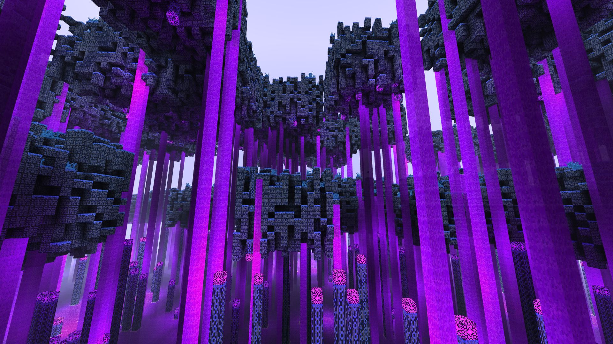

<h1 align="center">
 ⛯ Divine Voxel Engine ⛯
</h1>

<p align="center">

</p>

<p align="center">
<b>A multi-threaded, renderer-independent voxel engine in TypeScript.</b><br>
Build Minecraft-style voxel worlds and games that run in the browser.
</p>

<p align="center">
<a href="https://www.npmjs.com/package/@divinevoxel/vlox"></a>
<a href="https://github.com/Divine-Star-Software/DivineVoxelEngine/blob/main/LICENSE"></a>
<a href="https://github.com/Divine-Star-Software/DivineVoxelEngine/stargazers"></a>
<a href="https://discord.gg/98xEVU7TKn"></a>
</p>

---


<p align="center">
<a href="https://stackblitz.com/edit/dve-demos"><b>Try the live demo</b></a>
&nbsp;·&nbsp;
<a href="https://divine-star-software.github.io/DivineVoxelEngine/"><b>Browse the Vlox demos</b></a>
&nbsp;·&nbsp;
<a href="./GETTING_STARTED.md"><b>Getting Started guide</b></a>
</p>

## Quick Start

Install the core, the Babylon renderer, and the Amodx suite:

```console
npm install @babylonjs/core
npm install @amodx/suite @divinevoxel/vlox @divinevoxel/vlox-babylon
```

Then follow **[GETTING_STARTED.md](./GETTING_STARTED.md)** to go from an empty
project to generating and rendering a world .

## Features

- **Renderer-independent core.** The voxel engine lives in `@divinevoxel/vlox`
  and knows nothing about a specific renderer. Official renderers exist for
  Babylon.js (Classic and PBR shaders), with Three.js and WebGPU renderers in
  development.
- **Multi-threaded by design.** Meshing, world generation, and world updates all
  run in parallel across web workers. Shared memory (SharedArrayBuffer) is on by
  default and can be turned off.
- **Fast meshing via precomputed rules.** Voxel models are exploded into faces,
  and every culling and ambient-occlusion relationship is computed **once at
  registration** into flat lookup tables. At mesh time the hot loop is cheap
  array lookups against those tables.
- **JSON-driven model & geometry system.** Describe voxel shapes as reusable
  geometry (boxes, quads, triangles) and wire them into models with JSON. AO,
  lighting, and culling are handled automatically. Reuse one model across many
  voxels, and expose many looks through the **state** (geometry) and **mod**
  (inputs) layers.
- **Rich voxel behavior.** Sunlight and light propagation, liquid flow, level
  states , light-emitting voxels, transparency, and secondary
  voxels in a single cell (water-logged blocks and the like).
- **Effectively infinite worlds.** A world simulation keeps sectors loaded around
  one or more moving generators, running each new sector through a fixed
  pipeline (generation → decoration → sunlight → propagation → build). Supports
  multiple generators and multiple dimensions.
- **Two-pass world generation.** A simple brush API paints terrain in a
  `generate` pass and features (grass, trees, ores) in a `decorate` pass that can
  read back what was already placed.
- **Saving & archiving.** Pluggable world storage (with an IndexedDB example)
  streams sectors in and out as the player moves, and an archiving API exports
  whole regions and templates to compact **binary** or human-readable **JSON**.
- **Runtime building.** `VoxelBuildSpace` places and erases voxels in a live
  world, with raycast picking, oriented placement, bounded edit regions, and
  update hooks. Work with many voxels at once through **templates** and **selections**.
- **Flexible textures.** Atlases with named tiles, per-id variations, animated
  textures, and an option to pre-compact everything into a single atlas + JSON.

## Core Packages

- **@divinevoxel/vlox**
  - Minecraft-like voxel data handling and meshing
  - Lighting, flow, level states, and secondary voxels
  - **Vlox Model System**
    - Describe voxel models through JSON
    - AO, lighting, and culling automatically handled
    - Create many states easily and re-use models across different voxels
  - World simulation engine for generation and update handling
  - Archiving API for exporting worlds and templates as binary data and JSON
  - **Multi-threaded**
    - All meshing and world updates run in parallel
    - Shared memory is on by default, but can be turned off

- **@divinevoxel/vlox-babylon**
  - Renderer for DVE Vlox using Babylon.js, including Classic and PBR shaders

## Packages for Game Development

- **@dvegames/vlox**
  - A library of components for building games with Babylon.js and `@divinevoxel/vlox`

- **@dvegames/vlox-tools**
  - A library for creating tool panels for any `@divinevoxel/vlox` project

<details>
  <summary>Shared Memory</summary>
Originally the engine was built to use SharedArrayBuffers but that caused some issues. 
You can now turn off shared memory usage like this:

```ts
import { StartRenderer } from "@divinevoxel/vlox/Init/StartRenderer";
//...
  const DVER = await StartRenderer({
    renderer,
    worldWorker,
    mesherWorkers,
    generatorWorkers,
    voxels: DVEVoxelData,
    memoryAndCPU: {
      useSharedMemory: false,
    },
  });

```

With `useSharedMemory` set to `false` you will only have access to world data in the World thread. 

</details>
<details>
  <summary>In Dev Packages</summary>
These packages have not been worked on in a while and may be worked on in future if there is demand for them.

- **@divinevoxel/vlox-three**  
  - Renderer for DVE Vlox using Three.js, including Classic and PBR shaders

- **@divinevoxel/vlox-quantum**  
  - Custom renderer for DVE Vlox using WebGPU

</details>


# Games & Demos

## Crystalline Bliss

3D Puzzle with environments built with the engine. 

[Play On itch.io](https://divinestarsoftware.itch.io/crystalline-bliss)

[Buy On Steam](https://store.steampowered.com/app/2547740/Crystalline_Bliss/)


## Divine Craft

Demo game showing off biome based infinite world generation.

[Github Repo](https://github.com/Divine-Star-Software/DivineCraft)

[Check Out Now](https://dc.divinevoxelengine.org/)


# Screenshots 


## Vlox Babylon

## PBR


## Classic




## Developing DVE (Monorepo Setup)

You only need the Quick Start above to **build with** DVE. The steps below are for
working **on** the engine itself.

This project is a monorepo that holds all the Divine Voxel Engine packages and required libraries from Amodx. To initialize the project, just run the following commands:

```console
git clone https://github.com/Divine-Star-Software/DivineVoxelEngine.git
cd ./DivineVoxelEngine
git pull
git lfs pull
git submodule update --init --recursive
git submodule foreach git checkout main
git submodule foreach git pull
npm run init:all
npm install --workspaces=false
cd ./demos/Vlox
npm run start
```

## Community

Join the Divine Star community here to get updates: [discord](https://discord.gg/98xEVU7TKn).

See videos of development here:
[Divine Star Software YouTube Channel](https://www.youtube.com/channel/UC6n2h7qiuEHI6oLLvod5wdg)

<a href="https://github.com/lucasdamianjohnson">
  
  
</a>